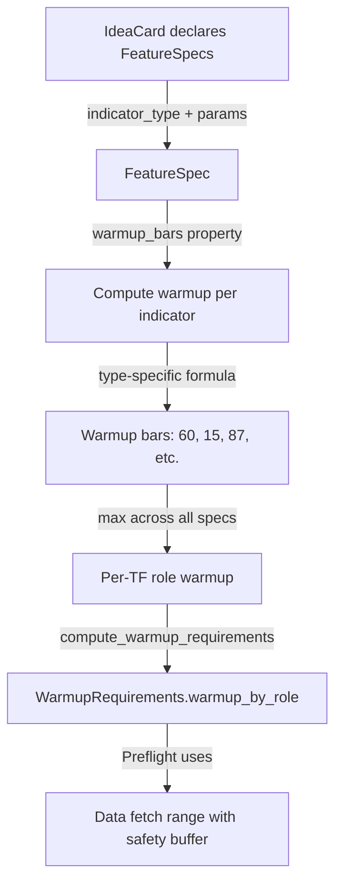

# Indicator Warmup Architecture & Adding New Indicators

**Date**: December 17, 2024  
**Type**: Architecture Documentation  
**Scope**: Indicator warmup computation, variable warmup requirements, adding new pandas_ta indicators  
**Status**: Post-Preflight-Backfill Implementation

---

## Executive Summary

This document explains how warmup requirements are computed from indicator types and their parameters, and provides a guide for adding new pandas_ta indicators to the system.

**Key Findings**:
- ✅ Warmup is **variable** and computed dynamically from indicator types + parameters
- ✅ Each indicator type has a specific warmup formula (EMA: 3×length, RSI: length+1, etc.)
- ✅ Warmup functions are **optional** but recommended for accurate data fetch ranges
- ✅ Indicator registry is the **critical gate** - must be registered to be usable
- ✅ Dynamic computation via `compute_indicator()` handles all registered indicators

---

## Table of Contents

1. [How Warmup is Computed from Indicators](#how-warmup-is-computed-from-indicators)
2. [Variable Warmup Requirements](#variable-warmup-requirements)
3. [Indicator Warmup Formulas](#indicator-warmup-formulas)
4. [Adding New Indicators](#adding-new-indicators)
5. [Architecture Overview](#architecture-overview)

---

## How Warmup is Computed from Indicators

### Flow: IdeaCard → FeatureSpec → Warmup Requirements



### Step-by-Step Process

1. **IdeaCard declares FeatureSpecs** with `indicator_type` and `params`
2. **Each FeatureSpec.warmup_bars** computes warmup based on:
   - Indicator type (EMA, SMA, RSI, MACD, etc.)
   - Indicator parameters (length, fast, slow, signal, etc.)
3. **compute_warmup_requirements()** takes the **max** across all FeatureSpecs per TF role
4. **Preflight** uses computed warmup to determine data fetch range

### Code Location

**Warmup Computation Entry Point**:
- `src/backtest/execution_validation.py:421-461` - `compute_warmup_requirements()`

**Per-Indicator Warmup**:
- `src/backtest/features/feature_spec.py:450-513` - `FeatureSpec.warmup_bars` property
- `src/backtest/indicator_vendor.py:716-771` - Warmup calculation functions

---

## Variable Warmup Requirements

### Warmup is Variable Based on Parameters

Warmup requirements are **not fixed** - they vary based on indicator parameters:

| Indicator | Parameters | Warmup Formula | Example |
|-----------|-----------|----------------|---------|
| **EMA** | `length=20` | `3 × length` | 60 bars |
| **EMA** | `length=50` | `3 × length` | **150 bars** (variable!) |
| **SMA** | `length=20` | `length` | 20 bars |
| **RSI** | `length=14` | `length + 1` | 15 bars |
| **MACD** | `fast=12, slow=26, signal=9` | `3 × slow + signal` | 87 bars |
| **STOCHRSI** | `length=14, rsi_length=14, k=3, d=3` | `rsi_length + length + max(k,d)` | 31 bars |

### Example: Variable Warmup in Practice

If your IdeaCard has:
```yaml
tf_configs:
  exec:
    feature_specs:
      - indicator_type: EMA
        params: {length: 20}  # → 60 bars warmup
      - indicator_type: RSI
        params: {length: 14}  # → 15 bars warmup
  htf:
    feature_specs:
      - indicator_type: MACD
        params: {fast: 12, slow: 26, signal: 9}  # → 87 bars warmup
```

Then `compute_warmup_requirements()` returns:
- `warmup_by_role['exec'] = max(60, 15) = 60 bars`
- `warmup_by_role['htf'] = 87 bars`

**Preflight then fetches**:
- Exec TF: `window_start - (60 + safety_buffer) × tf_minutes`
- HTF TF: `window_start - (87 + safety_buffer) × tf_minutes`

---

## Indicator Warmup Formulas

### Current Warmup Functions

**Location**: `src/backtest/indicator_vendor.py:716-771`

```python
def get_ema_warmup(length: int, stabilization_factor: int = 3) -> int:
    """EMA needs 3×length for stabilization (97% of true value)."""
    return length * stabilization_factor

def get_sma_warmup(length: int) -> int:
    """SMA needs exactly length bars."""
    return length

def get_rsi_warmup(length: int) -> int:
    """RSI needs length+1 for first delta calculation."""
    return length + 1

def get_atr_warmup(length: int) -> int:
    """ATR needs length+1 for previous close reference."""
    return length + 1

def get_macd_warmup(fast: int, slow: int, signal: int) -> int:
    """MACD needs slow EMA stabilization + signal line."""
    return slow * 3 + signal

def get_bbands_warmup(length: int) -> int:
    """Bollinger Bands same as SMA."""
    return length

def get_stoch_warmup(k: int, d: int, smooth_k: int) -> int:
    """Stochastic needs %K smoothing + %D calculation."""
    return k + smooth_k + d

def get_stochrsi_warmup(length: int, rsi_length: int, k: int, d: int) -> int:
    """StochRSI needs RSI + Stochastic cascade."""
    return rsi_length + length + max(k, d)
```

### Fallback Behavior

If an indicator type doesn't have a warmup function, `FeatureSpec.warmup_bars` falls back to:
```python
# From feature_spec.py:512-513
else:
    # Fallback for unknown types
    return self.length
```

This uses the `length` parameter (or 0 if not present), which works but may be inaccurate for complex indicators.

---

## Adding New Indicators

### Step-by-Step Guide

To expose a new pandas_ta indicator, follow these steps:

#### 1. Add to Indicator Registry (REQUIRED)

**File**: `src/backtest/indicator_registry.py`

Add entry to `SUPPORTED_INDICATORS`:

```python
SUPPORTED_INDICATORS: Dict[str, Dict[str, Any]] = {
    # ... existing indicators ...
    
    "your_indicator": {
        "inputs": {"close"},  # Required: {"close"}, {"high", "low", "close"}, etc.
        "params": {"length"},  # Required: accepted parameters
        "multi_output": False,  # Required: True if multi-output
        "output_keys": (),  # If multi-output: ("key1", "key2", ...)
        "primary_output": None,  # If multi-output: "key1" (primary output)
    },
}
```

**Why Required**: `compute_indicator()` checks registry before calling pandas_ta. Unregistered indicators are rejected even if they exist in pandas_ta.

#### 2. Add to IndicatorType Enum (if new type)

**File**: `src/backtest/features/feature_spec.py`

Add to `IndicatorType` enum:

```python
class IndicatorType(str, Enum):
    # ... existing types ...
    YOUR_INDICATOR = "your_indicator"
```

#### 3. Add Warmup Function (OPTIONAL but recommended)

**File**: `src/backtest/indicator_vendor.py`

Add warmup calculation function:

```python
def get_your_indicator_warmup(length: int) -> int:
    """
    Calculate warmup bars for YourIndicator.
    
    Formula based on indicator's mathematical requirements.
    """
    return length  # or your custom formula
```

**Why Optional**: Falls back to `self.length` if not provided, but custom formula is more accurate.

#### 4. Wire Warmup in FeatureSpec (OPTIONAL)

**File**: `src/backtest/features/feature_spec.py`

Add case in `FeatureSpec.warmup_bars` property:

```python
@property
def warmup_bars(self) -> int:
    # ... existing cases ...
    
    elif ind_type == IndicatorType.YOUR_INDICATOR:
        length = self.params.get("length", 20)  # Get params
        return get_your_indicator_warmup(length)
    
    else:
        # Fallback for unknown types
        return self.length
```

#### 5. Add Multi-Output Keys (if multi-output)

**File**: `src/backtest/features/feature_spec.py`

If indicator produces multiple outputs, add to `MULTI_OUTPUT_KEYS`:

```python
MULTI_OUTPUT_KEYS: Dict[IndicatorType, Tuple[str, ...]] = {
    # ... existing ...
    IndicatorType.YOUR_INDICATOR: ("output1", "output2", "output3"),
}
```

### Example: Adding ADX Indicator

ADX is already in the system, but here's what would be needed:

1. **Registry Entry** (already exists):
```python
"adx": {
    "inputs": {"high", "low", "close"},
    "params": {"length"},
    "multi_output": True,
    "output_keys": ("adx", "dmp", "dmn", "adxr"),
    "primary_output": "adx",
}
```

2. **Enum Entry** (already exists):
```python
ADX = "adx"
```

3. **Warmup Function** (optional - currently uses fallback):
```python
def get_adx_warmup(length: int) -> int:
    """ADX needs length for DI calculation + smoothing."""
    return length + 1  # Example formula
```

4. **Wire in FeatureSpec** (optional - currently uses fallback):
```python
elif ind_type == IndicatorType.ADX:
    return get_adx_warmup(self.length)
```

---

## Architecture Overview

### Indicator Computation Flow

```
IdeaCard FeatureSpec
    ↓
IndicatorType + params
    ↓
IndicatorRegistry.is_supported()  ← CRITICAL GATE
    ↓
compute_indicator() (dynamic pandas_ta call)
    ↓
FeatureSpec.warmup_bars (type-specific formula)
    ↓
compute_warmup_requirements() (max across specs)
    ↓
Preflight data fetch (warmup + safety buffer)
```

### Key Components

| Component | File | Purpose |
|-----------|------|---------|
| **IndicatorRegistry** | `indicator_registry.py` | Defines supported indicators, inputs, params |
| **compute_indicator()** | `indicator_vendor.py` | Dynamic wrapper for pandas_ta calls |
| **FeatureSpec.warmup_bars** | `feature_spec.py` | Type-specific warmup calculation |
| **compute_warmup_requirements()** | `execution_validation.py` | Aggregates warmup per TF role |
| **Warmup functions** | `indicator_vendor.py` | Per-indicator warmup formulas |

### Critical Gates

1. **Registry Gate**: Indicator must be in `SUPPORTED_INDICATORS` or `compute_indicator()` rejects it
2. **Warmup Gate**: If no warmup function, falls back to `self.length` (may be inaccurate)
3. **Preflight Gate**: Uses computed warmup to determine data fetch range

---

## Summary

### Key Takeaways

1. **Warmup is Variable**: Same indicator type with different parameters has different warmup (EMA 20 = 60 bars, EMA 50 = 150 bars)

2. **Computed Dynamically**: Each `FeatureSpec.warmup_bars` computes warmup from indicator type + params

3. **Registry is Required**: Must add to `SUPPORTED_INDICATORS` to enable an indicator

4. **Warmup Functions are Optional**: Falls back to `self.length` if not provided, but custom formulas are more accurate

5. **Preflight Uses Computed Warmup**: Single source of truth from `compute_warmup_requirements()` → Preflight → Runner → Engine

### Adding New Indicators Checklist

- [ ] Add to `SUPPORTED_INDICATORS` in `indicator_registry.py` (REQUIRED)
- [ ] Add to `IndicatorType` enum in `feature_spec.py` (if new type)
- [ ] Add warmup function in `indicator_vendor.py` (OPTIONAL but recommended)
- [ ] Wire warmup in `FeatureSpec.warmup_bars` (OPTIONAL)
- [ ] Add to `MULTI_OUTPUT_KEYS` if multi-output (if applicable)

---

## References

- Indicator Registry: `src/backtest/indicator_registry.py`
- Warmup Functions: `src/backtest/indicator_vendor.py:716-771`
- FeatureSpec Warmup: `src/backtest/features/feature_spec.py:450-513`
- Warmup Aggregation: `src/backtest/execution_validation.py:421-461`
- pandas_ta Reference: `reference/pandas_ta_repo/`

