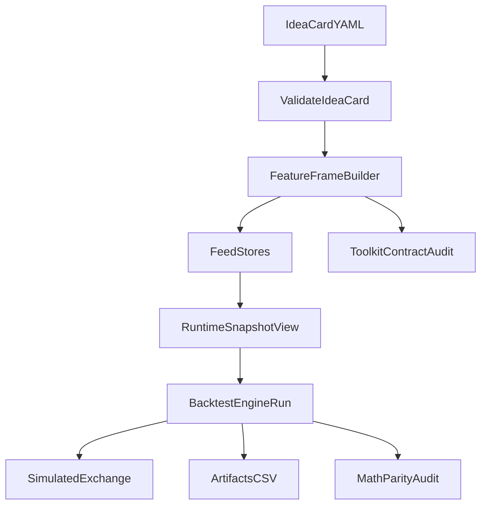

# Array-Backed Hot Loop Refactor

**Status**: Phases 1-4 ✅ COMPLETE; Phase 5 📋 **UNBLOCKED AND READY** (Price Feed complete 2025-12-31)  
**Created**: 2025-12-16  
**Updated**: 2025-12-17 (governance cleanup)  
**Goal**: Refactor BacktestEngine hot loop to use array-backed FeedStores + RuntimeSnapshotView (no pandas in loop), then migrate to Parquet artifacts, then add market structure features.

## Scope

- **In-scope**: Phase 1 (array-backed hot loop + snapshot prep) and Phase 2 (audit lock-in).
- **Out-of-scope**: Parquet migration (Phase 3) and beyond.

---

## Hard Constraints

| ID | Constraint |
|----|------------|
| **A** | No artifact schema/key changes during Phase 1 (audit validity; proves refactor is mechanical) |
| **C** | Keep CSV as primary for normal artifacts; Parquet is deferred to Phase 3 |
| **D** | **Entropy Control**: Phase 1 scope narrow enough that a single failure can be diagnosed, reasoned about, and fully reverted in one focused sitting. Phase 1 may change plumbing and data access paths, but must not introduce new abstractions, reasoning paths, or storage formats. |

---

## Pre-Refactor Baseline (Historical)

> **NOTE**: This section describes the state BEFORE Phase 1–2 was implemented. It is preserved for reference only.

- Engine hot loop previously used pandas row access (`df.iloc[i]`) and built materialized `RuntimeSnapshot` via `SnapshotBuilder`.
- `RuntimeSnapshotView` and `FeedStore` existed but were not wired into the engine.
- Legacy CLI: `trade_cli.py backtest indicators --audit-math-from-snapshots` (snapshot-artifact-based).

## Current State (Post-Refactor)

- **RuntimeSnapshotView is the ONLY runtime snapshot** — legacy `RuntimeSnapshot` paths are DELETED.
- Engine hot loop uses **array-indexed access** from `FeedStore` (no `df.iloc`, no pandas in loop).
- `SnapshotBuilder` and `_build_snapshot()` are DELETED from engine.
- Audits wired via CLI:
  - Toolkit contract audit: `trade_cli.py backtest audit-toolkit`
  - Math parity: `trade_cli.py backtest math-parity`

---

## Target State

- Engine hot loop is **array-indexed** (no pandas ops in-loop).
- Strategy evaluation uses **`RuntimeSnapshotView`**.
- HTF/MTF mapping is **O(1)** (precomputed `ts_close_ms → idx` mapping + forward-fill semantics).
- Audits provide a **hard gate** that Phase 1 changed plumbing, not math.



---

## Phase 1 — Array-Backed Snapshot Preparation (Performance + Plumbing Only)

**Goal**: Replace per-bar pandas access with array access, and switch engine strategy input to `RuntimeSnapshotView`.

### Change Budget (anti-drift)

**Allowed file changes (Phase 1):**
- `src/backtest/engine.py`
- `src/backtest/runtime/feed_store.py`
- `src/backtest/runtime/snapshot_view.py`
- `src/backtest/execution_validation.py` (adapter hook only; no new logic)
- `src/backtest/simulated_risk_manager.py` (adapter hook only; no new logic)

**Disallowed changes (Phase 1):**
- Any indicator math changes
- Any artifact schema/writer changes
- Any Parquet writer/reader changes
- Any strategy logic changes
- Any new caching/history abstractions (e.g., deques) not already required

### Checklist

- [x] 1.1 Build FeedStores once (prep phase)
  - Use `FeatureFrameBuilder` output (`FeatureArrays`) and create `FeedStore` via `FeedStore.from_dataframe_with_features()`
  - Produce a `MultiTFFeedStore` holding exec/htf/mtf feeds
  - Files: `engine.py`, `feed_store.py`
  - **Done**: Added `_build_feed_stores()` method in engine.py

- [x] 1.2 Add O(1) ts_close→index mapping for each FeedStore
  - Implement precomputed `ts_close_ms_to_idx: Dict[int, int]` (epoch milliseconds → array index)
  - Keys derived from `bar.ts_close` in epoch ms (avoid tz/naive datetime drift)
  - Replace any per-step filtering like `df[mask].iloc[-1]` in multi-TF cache refresh
  - Files: `feed_store.py`, `engine.py`
  - **Done**: Added `ts_close_ms_to_idx` dict and `get_idx_at_ts_close()` method

- [x] 1.3 Refactor `BacktestEngine.run()` hot loop to array indexing
  - Replace: `row = df.iloc[i]` / per-bar feature dict extraction
  - With: `open/high/low/close/volume = exec_feed.<array>[i]`
  - Keep canonical Bar semantics (ts_open for fills, ts_close for evaluation)
  - Preserve lookahead guard
  - File: `engine.py`
  - **Done**: Hot loop now uses `exec_feed.open[i]`, etc.

- [x] 1.4 Switch strategy snapshot type to `RuntimeSnapshotView`
  - Engine builds `RuntimeSnapshotView` with exec_idx, htf_idx, mtf_idx
  - Include mark_price + mark_price_source from StepResult
  - Offsets via direct idx arithmetic (idx - offset) on relevant TF index
  - Remove engine dependence on `_snapshot_builder.build_with_defaults()` in hot loop
  - Files: `engine.py`, `snapshot_view.py`
  - **Done**: Added `_build_snapshot_view()` method, hot loop uses it

- [x] 1.5 Provide unified feature lookup API for IdeaCard evaluation
  - Add method on `RuntimeSnapshotView` supporting:
    - `tf_role in {exec, htf, mtf}`
    - `indicator_key` (OHLCV keys + indicator keys)
    - `offset` (previous values)
  - `IdeaCardSignalEvaluator._get_feature_value()` requires RuntimeSnapshotView (fail-fast on legacy)
  - Files: `snapshot_view.py`, `execution_validation.py`
  - **Done**: Added `get_feature()` and `has_feature()` to RuntimeSnapshotView

- [x] 1.6 Update simulator sizing to require RuntimeSnapshotView only
  - `SimulatedRiskManager` requires `RuntimeSnapshotView` (fail-fast on legacy)
  - Uses `snapshot.close` for entry price (O(1) array access)
  - File: `simulated_risk_manager.py`
  - **Done**: RuntimeSnapshotView only; raises TypeError on legacy snapshot

### Phase 1 Acceptance Gate

- [x] **No artifact schema/key changes** for normal run outputs (CSV-based artifacts unchanged)
- [x] **No pandas ops in hot loop** (no `df.iloc`, no row scanning)
- [x] **MTF semantics preserved** (HTF/MTF forward-fill on close only)
- [x] **Lookahead guard passes** (`snapshot.ts_close == bar.ts_close`)
- [x] **Smoke parity** (Verified: single-TF and multi-TF backtests produce valid results)

**Single-causal-diff definition:**
> The only intended behavior change is data-access plumbing: `pandas row access + materialized RuntimeSnapshot → array access + RuntimeSnapshotView wiring`.
> Any other behavior change is a Phase 1 failure.

**Stop-the-line gates:**
- No DataFrame references inside the per-bar hot loop (no `df.*`, no DataFrame slicing/filtering)
- No feature dict materialization in-loop (no `to_dict()`, no building per-bar feature dicts)
- MTF alignment synthetic test passes (exec-close anchored forward-fill)
- Strategy invocation asserted only at exec ts_close
- Smoke parity: NaN masks match for a fixed window on 3 representative indicators (full parity is Phase 2)

---

## Phase 1.5 — Legacy Removal (NO BACKWARD COMPAT)

**Goal**: Remove all legacy RuntimeSnapshot paths. RuntimeSnapshotView is the ONLY snapshot.

### Checklist

- [x] 1.5.1 Remove legacy feature access from `execution_validation.py`
  - `IdeaCardSignalEvaluator._get_feature_value()` now requires RuntimeSnapshotView
  - Raises TypeError if legacy RuntimeSnapshot passed
  - **Done**: Legacy fallback code deleted
  
- [x] 1.5.2 Remove RuntimeSnapshot support from `simulated_risk_manager.py`
  - Requires RuntimeSnapshotView with `.close` property
  - Raises TypeError if legacy snapshot passed
  - **Done**: Legacy `snapshot.bar_ltf.close` path deleted
  
- [x] 1.5.3 Remove backward compat shims from `snapshot_view.py`
  - Deleted: `exchange_state` shim property
  - Deleted: `bar_ltf`, `features_exec`, `features_ltf`, `features_htf`, `features_mtf` aliases
  - Kept: Core SnapshotView contract (`get_feature`, `has_feature`, `close`, etc.)
  - **Done**: Legacy aliases removed
  
- [x] 1.5.4 Delete legacy `_build_snapshot` from `engine.py`
  - Deleted: `_build_snapshot()` method
  - Deleted: `SnapshotBuilder` import and instantiation
  - Engine now only uses `_build_snapshot_view()`
  - **Done**: Legacy snapshot builder code deleted
  
- [x] 1.5.5 Update `runner.py` to use direct snapshot properties
  - Changed: `snapshot.exchange_state.has_position` → `snapshot.has_position`
  - Changed: `snapshot.exchange_state.position_side` → `snapshot.position_side`
  - **Done**: Direct property access

---

## Phase 2 — Audit Lock-In

**Goal**: Prove Phase 1 changed plumbing, not math.

### Checklist

- [x] 2.1 Contract audit gate
  - Run toolkit contract audit via CLI (`trade_cli.py backtest audit-toolkit`)
  - Acceptance: 0 contract breaches
  - **PASSED**: 42/42 indicators validated

- [x] 2.2 Indicator math parity gate (in-memory parity; no artifacts)
  - **NEW**: In-memory parity audit implemented in `src/backtest/audit_in_memory_parity.py`
  - Compares FeatureFrameBuilder output against fresh pandas_ta computation
  - Validates: Identical NaN masks, values within tolerance (1e-8)
  - Output: small CSV diff report (summary + first N mismatches)
  - Does NOT emit snapshots, does NOT write Parquet
  - CLI: `trade_cli.py backtest math-parity --idea-card <path> --start <date> --end <date>`
  - **PASSED**: 5/5 columns validated (max_diff = 0.0)
  - **TODO (future enhancement)**: Add RuntimeSnapshotView.get_feature() plumbing parity — sample at deterministic exec-close and TF-close points, compare against underlying arrays to validate offsets and TF routing. Current audit validates indicator math only.

- [x] 2.3 Lock pipeline signature truth
  - `pipeline_signature.json` always reports `snapshot_impl = "RuntimeSnapshotView"` (hardcoded in dataclass)
  - No runtime flags or conditionals — legacy paths deleted
  - Files: `src/backtest/artifacts/pipeline_signature.py`

### Phase 2 Acceptance Gate

- [x] Toolkit contract audit passes (42/42)
- [x] In-memory math parity passes (5/5, max_diff = 0.0)
- [x] Pipeline signature reflects the real path used (`RuntimeSnapshotView`)

### Drift-Prevention Assertions (HARD GATES)

> These assertions are enforced by code and must remain true post-Phase-2:

1. **RuntimeSnapshotView is the ONLY runtime snapshot** — no Union types, no dual-path support.
2. **Legacy snapshot paths are DELETED, not deprecated** — `RuntimeSnapshot`, `SnapshotBuilder`, `_build_snapshot()` do not exist in engine.
3. **Phase 2 parity MUST pass before freezing Phase 1–2** — no exceptions.
4. **Fail-fast on legacy callers** — any code passing `RuntimeSnapshot` to evaluator or risk manager gets immediate `TypeError`.

### Audit Run Details (2025-12-16)

```
trade_cli.py backtest math-parity --idea-card BTCUSDT_15m_mtf_tradeproof --start "2025-12-01" --end "2025-12-14"

Result: PASS
- Contract audit: 42/42 indicators
- Parity audit: 5/5 columns (max_abs_diff = 0.0, tolerance = 1e-8)
```

---

## File Change Summary

| File | Phase | Change Type |
|------|-------|-------------|
| `src/backtest/engine.py` | 1, 1.5 | Hot loop refactor + delete legacy `_build_snapshot()` + `SnapshotBuilder` |
| `src/backtest/runtime/feed_store.py` | 1 | Add ts_close_ms_to_idx mapping |
| `src/backtest/runtime/snapshot_view.py` | 1, 1.5 | Unified feature API + delete backward-compat aliases |
| `src/backtest/execution_validation.py` | 1, 1.5 | Require RuntimeSnapshotView (no legacy fallback) |
| `src/backtest/simulated_risk_manager.py` | 1, 1.5 | Require RuntimeSnapshotView (no legacy fallback) |
| `src/backtest/runner.py` | 1.5 | Use direct snapshot properties (no `exchange_state` shim) |
| `src/backtest/audit_in_memory_parity.py` | 2 | **NEW**: In-memory parity audit |
| `src/backtest/artifacts/pipeline_signature.py` | 2 | Always report `snapshot_impl="RuntimeSnapshotView"` (no flags) |
| `src/tools/backtest_cli_wrapper.py` | 2 | Add `math-parity` gate tool |
| `trade_cli.py` | 2 | Add `backtest math-parity` command |

---

## Immediate Next Steps

1. ✅ Create this TODO document
2. ✅ Implement Phase 1 in a single PR-sized change set
   - FeedStore with ts_close_ms_to_idx mapping
   - Engine hot loop uses array indexing
   - RuntimeSnapshotView used for strategy evaluation
   - Unified feature lookup API
   - SimulatedRiskManager accepts RuntimeSnapshotView only
3. ✅ Phase 1.5: Remove all legacy paths
   - Delete `_build_snapshot()` and `SnapshotBuilder` from engine
   - Delete backward-compat aliases from RuntimeSnapshotView
   - Make evaluator + risk manager require RuntimeSnapshotView
4. ✅ Run Phase 2 audit gates and freeze as new baseline
   - Toolkit contract audit: **42/42 PASSED**
   - In-memory math parity audit: **5/5 PASSED**
   - Pipeline signature: `snapshot_impl="RuntimeSnapshotView"`
5. ✅ ALL PHASES COMPLETE — Ready for Phase 3 (Parquet migration)

---

## Phase 4 — Snapshot Plumbing Parity Audit

**Status:** ✅ **COMPLETE** — All acceptance gates passed  
**Goal**: Validate RuntimeSnapshotView.get_feature() plumbing correctness.

This audit proved the snapshot plumbing is correct without testing indicator math (Phase 2 already covers that).

### What Phase 4 validates:
- TF routing: `get_feature(..., tf_role="exec"|"htf"|"mtf")` returns values from correct feed
- Offset semantics: `get_feature(..., offset=0|1|2|...)` correctly computes target index
- Forward-fill behavior: HTF/MTF indices remain constant between TF closes
- Closed-candle only: `snapshot.ts_close` equals `exec_feed.ts_close[exec_idx]`

### What Phase 4 does NOT validate:
- Indicator math (Phase 2 already validates this)
- Strategy logic
- Order execution
- Risk management

### Checklist ✅ COMPLETE

- [x] 4.1 Create audit module (`audit_snapshot_plumbing_parity.py`)
  - PlumbingParityResult dataclass
  - audit_snapshot_plumbing_parity() function
  - Deterministic sparse sampling (first N + TF close boundaries)
  - Comparison logic (observed vs expected per key/tf_role/offset)
  
- [x] 4.2 Add engine callback support
  - Optional `on_snapshot` parameter in BacktestEngine.__init__()
  - Invoke callback in hot loop after snapshot build, before strategy
  - No side effects, audit-only
  
- [x] 4.3 Add CLI command
  - `backtest audit-snapshot-plumbing` subcommand
  - Handler function with JSON output support
  - Pretty-print results
  
- [x] 4.4 Add CLI wrapper tool
  - backtest_audit_snapshot_plumbing_tool() in backtest_cli_wrapper.py
  - Export from tools module
  
- [x] 4.5 Validate acceptance gate
  - Run: `python -m compileall src` ✅ PASSED
  - Run: `python trade_cli.py backtest audit-toolkit` ✅ PASSED (42/42)
  - Run: `python trade_cli.py backtest math-parity` ✅ PASSED (contract=42/42, parity=3/3)
  - Run: `python trade_cli.py backtest audit-snapshot-plumbing` ✅ PASSED (1249 samples, 39968 comparisons, 0 failures)

### Phase 4 Acceptance Gate ✅ PASSED

- [x] Audit passes for single-TF config (exec only) — **1249 samples, 39968 comparisons, 0 failures**
- [x] Audit passes for multi-TF config (exec + htf + mtf) — **1249 samples, 39968 comparisons, 0 failures**
- [x] No false positives (all declared keys validate correctly)
- [x] Fast runtime (< 1 minute) — **0.76s achieved**
- [x] Clear failure messages (first mismatch details shown)

**Implementation Review:** `docs/reviews/PHASE_4_SNAPSHOT_PLUMBING_AUDIT_REVIEW.md` documents the complete implementation with 39,968 comparisons across 1,249 snapshots with zero failures.

### Phase 4 Runtime Constraints

- NO artifact emission (no snapshots, no parquet/csv beyond a small diff report)
- NO engine behavior changes (callback is audit-only observer)
- NO strategy evaluation changes
- NO indicator math changes
- Deterministic sampling (same input = same sample points)
- Fail-fast on first mismatch (if --strict flag set)

### CLI Usage

```bash
# Single-TF audit (exec only)
python trade_cli.py backtest audit-snapshot-plumbing \
  --idea-card verify_ema_atr \
  --start 2025-12-01 \
  --end 2025-12-14

# Multi-TF audit (exec + htf + mtf)
python trade_cli.py backtest audit-snapshot-plumbing \
  --idea-card BTCUSDT_15m_mtf_tradeproof \
  --start 2025-12-01 \
  --end 2025-12-14

# With options
python trade_cli.py backtest audit-snapshot-plumbing \
  --idea-card verify_ema_atr \
  --start 2025-12-01 \
  --end 2025-12-14 \
  --max-samples 5000 \
  --tolerance 1e-10 \
  --json
```

### Expected Output

On success:
```
✓ PASS: Snapshot plumbing parity PASSED: 2000 samples, 45000 comparisons (runtime: 23.4s)
  Samples: 2000
  Comparisons: 45000
  Max samples reached: True
  Runtime: 23.4s
```

On failure:
```
✗ FAIL: Value mismatch at htf/ema_fast

First mismatch:
  ts_close: 2025-12-05T14:45:00
  tf_role: htf
  key: ema_fast
  offset: 1
  observed: 42853.2145
  expected: 42853.2148
  abs_diff: 0.0003
  tolerance: 1e-12
  exec_idx: 1234
  htf_idx: 82
  target_idx: 81
```

---

## ✅ P0 BLOCKER — RESOLVED (2025-12-17)

**Phase 5 (Market Structure Features) is now UNBLOCKED.**

### Resolution Summary

**Bug Location**: `src/backtest/features/feature_frame_builder.py` (lines 633, 674)

**Fix Applied**:
```python
# Before (WRONG):
close=input_series if spec.input_source == InputSource.CLOSE else ohlcv["close"]

# After (FIXED):
close=input_series  # ALWAYS use the retrieved input series
```

**Additional Fix**: `src/backtest/audit_in_memory_parity.py` also fixed to use `input_source` when recomputing reference values.

**Validation Results**:
- Contract audit: **42/42** indicators validated ✅
- Math parity: **9/9** columns passed (was 8/9 before fix) ✅
- Plumbing audit: **217,512 comparisons, 0 failures** ✅
- 5m stress test: **27 trades completed** ✅

**See**: `docs/todos/P0_INPUT_SOURCE_ROUTING_FIX.md` — Complete execution log

**Gate**: ✅ PASSED — Phase 5 unblocked

---

## Phase 5 — Market Structure Features (READY)

**Status**: 📋 **UNBLOCKED AND READY** — All prerequisites complete (2025-12-31)
**Goal**: Add market structure feature layer (swings, pivots, trends, regimes)

**Planned Scope**:
- Market structure computation outside hot loop
- Structure features precomputed like indicators
- Added to FeatureSpec/FeatureFrame pipeline
- Exposed via RuntimeSnapshotView API
- Zone interaction via `px.rollup.*` accessors (rollup_min_1m, rollup_max_1m, etc.)

**Prerequisites** ✅ ALL MET:
- ✅ Input-source routing fix applied (2025-12-17)
- ✅ Volume SMA parity passes (9/9 columns)
- ✅ Math parity audit shows 0 failures (217,512 comparisons)
- ✅ **Price Feed (1m) + Preflight** complete (2025-12-31)
  - `px.rollup.*` accessors available for zone touch detection
  - Mandatory 1m coverage enforced by preflight
  - QuoteState dataclass for px.last/px.mark

